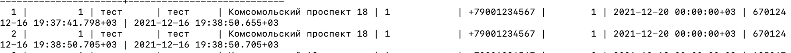
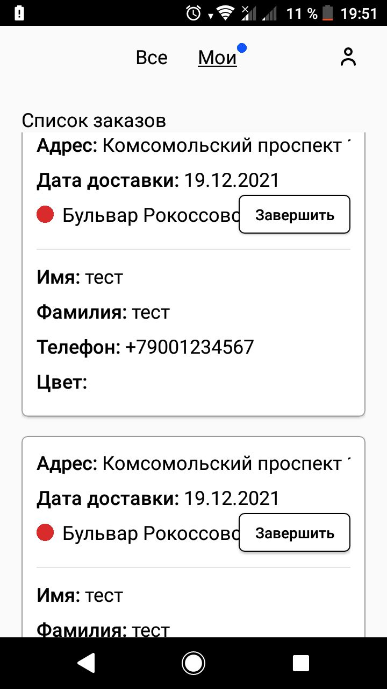

# Баг-репорт при тестировании мобильного приложения

<table border="1" cellpadding="1" cellspacing="1" style="width:624px">
	<tbody>
		<tr>
			<td style="text-align:center; width:216px"><strong>Название поля</strong></td>
			<td style="text-align:center; width:392px"><strong>Содержание</strong></td>
		</tr>
		<tr>
			<td style="text-align:center; width:216px"><strong>ID</strong></td>
			<td style="width:392px">BUG-298056</td>
		</tr>
		<tr>
			<td style="text-align:center; width:216px"><strong>Заголовок</strong></td>
			<td style="width:392px">Дублирование принятого заказа в мобильном приложении &quot;Яндекс.Самокат&quot;</td>
		</tr>
		<tr>
			<td style="text-align:center; width:216px"><strong>Предусловие</strong></td>
			<td style="width:392px">
			<ol>
				<li>Сделать заказ в веб-приложении</li>
				<li>Авторизоваться в мобильном приложении</li>
			</ol>
			</td>
		</tr>
		<tr>
			<td style="text-align:center; width:216px"><strong>Шаги воспроизведения</strong></td>
			<td style="width:392px">
			<ol>
				<li>В моб. приложении на экране &quot;Список заказов&quot; во вкладке &quot;Все&quot; принять созданный заказ</li>
				<li>Перейти во вкладку &quot;Мои&quot;</li>
			</ol>
			</td>
		</tr>
		<tr>
			<td style="text-align:center; width:216px"><strong>ОР</strong></td>
			<td style="width:392px">
			
Отображается принятый заказ

			</td>
		</tr>
		<tr>
			<td style="text-align:center; width:216px"><strong>ФР</strong></td>
			<td style="width:392px">Отображается 2 одинаковых заказа</td>
		</tr>
		<tr>
			<td style="text-align:center; width:216px"><strong>Приоритет</strong></td>
			<td style="width:392px">Критичный</td>
		</tr>
		<tr>
			<td style="text-align:center; width:216px"><strong>Окружение</strong></td>
			<td style="width:392px">Версия приложения: 3.6, ОС: Android 8.0.0, смартфон: Sony Xperia XA1</td>
		</tr>
		<tr>
			<td style="text-align:center; width:216px"><strong>Дополнительные материалы</strong></td>
			<td style="width:392px">
			
 Скриншот 1 

			
 Скриншот 2 

			</td>
		</tr>
	</tbody>
</table>

&nbsp;

